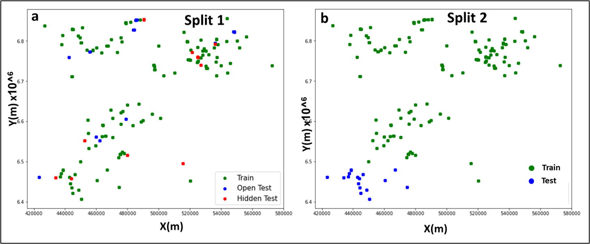

# Lithology-Prediction-with-Machine-Learning

This repository contains the codes for my Msc project at Imperial College London titled SUPERVISED MACHINE LEARNING APPROACH TO LOG-BASED LITHOLOGY LABELLING OF NORTH SEA WELLS!

## Aim
This research aims to produce model to automate lithology interpretation from well logs.

## Objectives
* Evaluate and improve the winning model from the FORCE competition.
* Apply different ML classifiers to obtain the best predictive model
* Train model with basic logs suites that will be widely adopted.

## Data Description
The dataset used in this study comes from the 2020 FORCE ML competition, which includes well logs from 118 wells in the Northern North Sea. Well-logs are a crucial source of subsurface information, and this dataset provides a comprehensive suite of logs commonly acquired in the industry. 

These logs are sensitive to changes in the depositional environment and facies, offering distinctive signatures useful for lithology identification. However, the dataset also presents challenges such as missing values and imbalanced lithology distribution.

## Available Dataset
The wells used in this study are located offshore Norway, within the Vikings Graben in the Northern North Sea. The well location plot; three well clusters are seen, with cluster one located NW, cluster 2 NE, and cluster 3 located towards the SW containing 27, 43, and 48 wells, respectively. The dataset contains some missing values GR contains no missing value, while SGR has the most missing data.

## Exploratory Data Analysis
Exploratory Data Analysis (EDA) is fundamental in a machine learning project, helping to identify trends, distributions, and anomalies in data using statistical and visual representations. EDA is crucial to understand data, detect outliers, and treat the data before employing ML algorithms to ensure a robust model.

### Correlation Analysis
Highly correlated features can introduce bias to models, especially linear regression models. The correlation matrix in notebook (correlation matrix) displays how different features correlate. For instance, the Caliper log is highly correlated with bit-size and DTC is highly correlated with DTS. Depth shows a strong negative correlation with Caliper, Nphi, DTC, and Bit-size, and a strong positive correlation with Rhob.

### Outlier Detection
Box plots and histograms were used to visualize data distribution and detect outliers. Points falling outside the whiskers of a box plot are considered outliers. For instance, the majority of the GR curve is between 0-200, with some extreme values. The PEF log has a normal distribution while other logs are skewed.

## Data Preparation and Preprocessing
Data usually come in varying formats; preprocessing prepares the data for predictions. The type of preprocessing depends on the data's nature and the machine learning algorithm. Preprocessing includes filling missing values, rescaling features, and handling outliers.

### Data Cleaning
Data cleaning involves finding and correcting errors in data, such as:

`Noise Filtering`: Well logs can contain noise due to borehole conditions, improper tool grounding, mechanical failure, etc. The Savitzky–Golay (SG) smoothing filter was used to reduce noise.

`Winsorization`: Adjusts the weights of outliers by replacing extreme values with specific percentiles to reduce their impact on the model.

### Handling Missing Values
One of the initial steps in data preparation is dealing with missing values. Logs with less than 35% missing values were selected for feature engineering. Various techniques can be employed to handle missing data, such as:

`Imputation`: Filling missing values with mean, median, or mode values.

`Interpolation`: Using neighbouring data points to estimate missing values.

`Deletion`: Removing records with excessive missing values should be done cautiously to avoid losing valuable information.

For this study, a combination of imputation and interpolation was used to manage missing values effectively.

## Splitting Data into Features and Labels, and Training and Validation Sets
An essential part of training models involves splitting the dataset into training, validation, and test sets. Two splits were used in this study:

The first split was based on the given data, with test sets evenly distributed around data locations.
The second split was based on the X and Y locations, reserving 13 southern wells for evaluation and using the other wells for training.

A function CreateSet was created to split data into train, test, and validation sets, ensuring no duplicate rows across subsets.

## Feature Selection
Feature selection involves identifying relevant features to the target variable and removing irrelevant ones to reduce computation costs and improve model performance. Features were selected based on petrophysical knowledge, missing values, correlation matrix and essential logs required for traditional lithology interpretation. Logs with over 35% missing data were dropped.

### Feature Augmentation
Feature engineering is deriving new features from the datasets that would enhance the model's performance. The new feature derived provides new insights into the target variable

#### Volume of Shale Computation
Vclay/shale gives an estimation of the amount of clay/shale in sediments. For example, a clean sandstone would have a very low clay content (VCL), and pure shales are thought to contain 60-70% clay. The volume of shale (Vsh) is a critical feature in lithology prediction. It is computed from the Gamma Ray (GR) log using the formula:

$  V_{sh} = \frac{GR_{log} - GR_{min}}{GR_{max} - GR_{min}}$

where 

$GR_{log}$  is the gamma-ray value at a particular depth, 

$GR_{min}$ is the minimum gamma ray value (clean sand baseline), 

$GR_{max}$ is the maximum gamma ray value (shale baseline).

#### Bestangin's Feature Augmentation
Bestangin's feature augmentation was adopted to further enhance model performance. This technique involves generating additional features that can provide more predictive power to the model. 

#### Addressing Imbalanced Lithology Distribution
The dataset's lithology distribution is imbalanced, with shale accounting for about 70% of the samples, while anhydrite, basement, and tuff represent less than 0.5%. This imbalance can skew the model's predictions towards the majority class (shale), reducing its effectiveness in identifying minority lithologies.

To address this issue, several techniques were employed:

`Resampling`: Using methods such as oversampling to increase the representation of minority classes and undersampling to reduce the majority class.

`Class weights`: Assigning higher weights to minority classes during model training to penalise misclassifications more heavily.

## Model Selection and Training
Three ensemble-based models were selected for training: Random Forest (RF), CatBoost (CAT), and Extreme Gradient Boosting (XGBoost). These models were chosen due to their capability to handle complex relationships in data and their proven performance in classification tasks.

* `Random Forest (RF)`: RF builds multiple decision trees during training and outputs the mode of the classes (classification) or the mean prediction (regression) of the individual trees.
* `CatBoost (CAT)`: CAT is a variant of gradient boosting that can handle categorical features inherently without preprocessing. It iteratively builds weak learners based on the gradients of the loss function.
* `Extreme Gradient Boosting (XGBoost)`: XGBoost is another gradient-boosting algorithm known for its speed and performance. It optimises its models using gradient descent, correcting errors with each new tree added to the model.

#### Model Evaluation
The models were evaluated using various metrics suitable for classification tasks:
* Accuracy Score: The proportion of correct predictions made by the model.
* Confusion Matrix: A table used to describe the performance of a classification model, showing the counts of true positive, true negative, false positive, and false negative predictions.
* Precision and Recall: Precision measures the accuracy of positive predictions, while recall measures the fraction of true positives correctly identified.

### Results

Each model was trained and evaluated on a subset of wells, with RF achieving an accuracy of 76%, CAT 70%, and XGBoost 75%. RF showed robust performance across multiple lithologies, while CAT struggled with certain classes like dolomite and anhydrite due to their low occurrence in the training data. XGBoost demonstrated high accuracy for shale, halite, and coal, but struggled with dolomite prediction.

Detailed discussion is based mainly on the best model(XGB), having a 75% overall accuracy. It obtained a high accuracy (80+%) for shales, halite and coal. In addition, sandstone, limestone, chalk and anhydrite, had about 60% accuracy. Sandstone/shale, dolomite, marl, and tuff had the least performance. Of the three models, only XGB have predicted dolomite, but with just 24% accuracy. 

Other models, including the FORCE winning models, fail to predict dolomite but had relative success with the other lithologies. The inability of the models to predict dolomite can be attributed to its low occurrence in the data. Also, distinguishing between dolomite and limestone from log data can be somewhat fuzzy.

It is observed that shale consistently yielded the highest score with all classifiers. This is because of the relatively high occurrence of shale in the dataset. Also, shales have unique well log properties that are often different and distinct from other lithologies. In comparison, sandstone/shale yielded a low prediction because there is no clear log distinction between sandstone and shale and sandstone/shale lithologies. 

A cross plot of Nphi, Rhob and GR, as shown `EDA_2D_3D.ipynb`, confirms this, as sandstone/shales either plots within shale clusters or sandstone clusters, explaining the model's confusion. In addition, there are concerns about the criteria used in labelling sandstone/shale. An interval labelled sandstone/shale could be shale with sandstone intercalation or the other way round.

