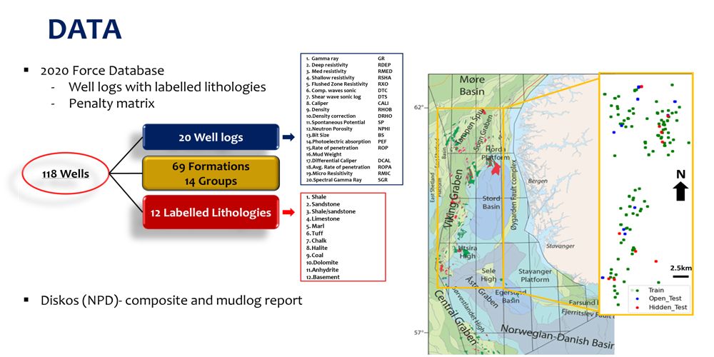

# Lithology-Prediction-with-Machine-Learning

This repository contains the codes for my Msc project at Imperial College London titled SUPERVISED MACHINE LEARNING APPROACH TO LOG-BASED LITHOLOGY LABELLING OF NORTH SEA WELLS!
## Data
The Force 2020 dataset was used

## Aim
This research aims to produce model to automate lithology interpretation from well logs.

## Objectives
* Evaluate and improve the winning model from the FORCE competition.
* Apply different ML classifiers to obtain the best predictive model
* Train model with basic logs suites that will be widely adopted.

